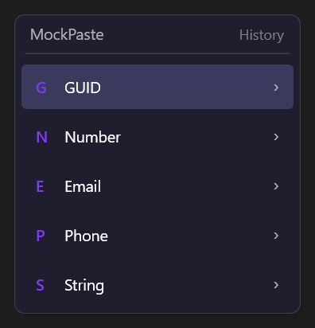
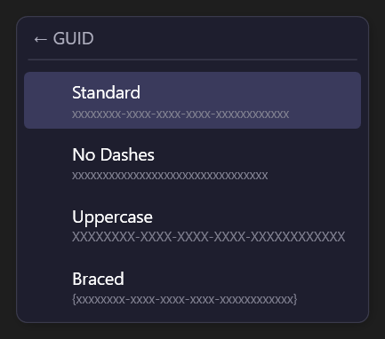
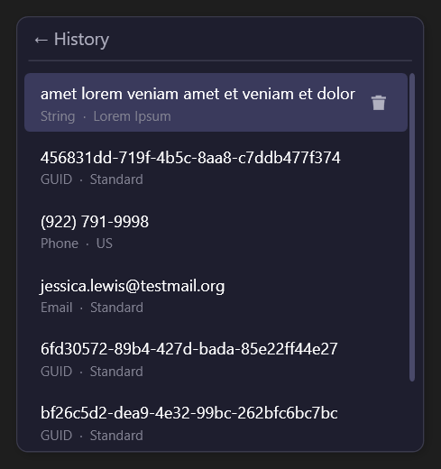
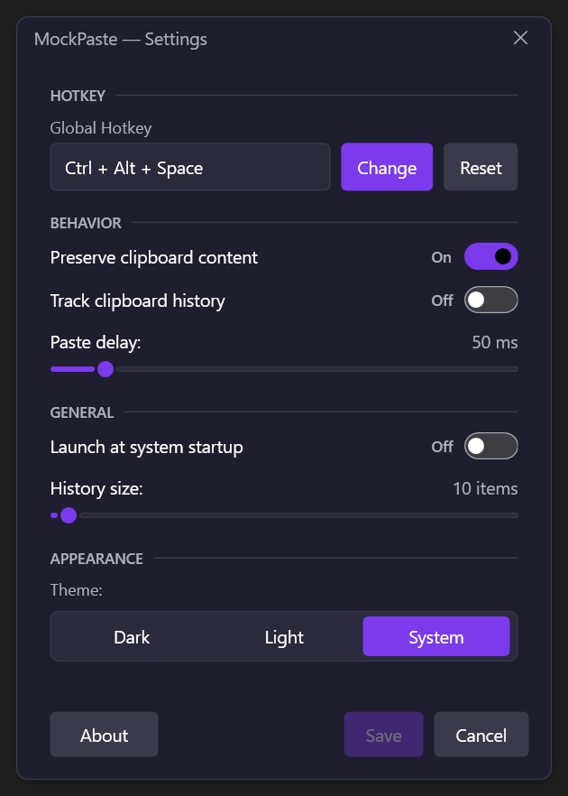

<div align="center">


# MockPaste

**Instant fake-data pasting, right from a global hotkey.**

[](LICENSE)
[](https://dotnet.microsoft.com/)
[](https://www.microsoft.com/windows)

</div>

---

MockPaste is a lightweight Windows tray application that lets you generate and paste realistic-looking fake data into any text field — without leaving your keyboard. Press a global hotkey, pick a category and format from the popup, and the value is typed straight into the focused window.

It is designed for developers and testers who constantly need to fill forms with GUIDs, email addresses, phone numbers, and other placeholder values during development and QA.

---

## Features

- **Global hotkey** — trigger the popup from any application with a fully customisable key combination (default: <kbd>Ctrl</kbd>+<kbd>Alt</kbd>+<kbd>Space</kbd>).
- **Instant paste** — generated values go straight into the active text field; no copy/paste steps needed.
- **Five built-in data generators**, each with multiple formats:

  | Category | Formats |
  |---|---|
  | **GUID** | Standard · No Dashes · Uppercase · Braced |
  | **Number** | Integer · Decimal · Percentage · Byte |
  | **Email** | Standard · Numbered · Simple · Plus alias |
  | **Phone** | US · International · Digits Only · Dotted |
  | **String** | Alphanumeric · Alpha Only · Hex String · Lorem Ipsum |

- **Keyboard mnemonics** — press <kbd>G</kbd>, <kbd>N</kbd>, <kbd>E</kbd>, <kbd>P</kbd>, or <kbd>S</kbd> in the popup to jump straight to a category.
- **Clipboard history** — optionally keep a list of recently generated values and re-paste any of them in one click.
- **Clipboard preservation** — the original clipboard content is automatically restored after each paste.
- **Dark / Light / System theme** — follows your Windows accent or picks a fixed theme.
- **Launch at startup** — optionally register in the Windows startup registry.
- **Localisation** — English and Russian UI out of the box.
- **Minimal footprint** — a single tray icon; no visible window, no taskbar entry.

---

## Requirements

| | |
|---|---|
| **OS** | Windows 10 or later |
| **Runtime** | [.NET 10 Desktop Runtime](https://dotnet.microsoft.com/en-us/download/dotnet/10.0) |

---

## Installation

1. Download `MockPaste-<version>.msi` from the [Releases](https://github.com/AlexeyPribytkin/mockpaste/releases) page.
2. Run the installer — it will verify that the [.NET 10 Desktop Runtime](https://dotnet.microsoft.com/en-us/download/dotnet/10.0) is present and abort with a download link if not.
3. Choose whether to create a **Desktop** and/or **Start Menu** shortcut during setup.
4. MockPaste installs to `%ProgramFiles%\MockPaste\`. Launch it from the shortcut or directly from the install folder.

> **Tip:** Enable **Launch at startup** in Settings so MockPaste is always available.

### Uninstalling

Use **Add or Remove Programs** (or `msiexec /x`). The uninstaller removes the application files, shortcuts, settings, and logs from `%AppData%\MockPaste\`.

---

## Usage

### Basic workflow

1. Focus any text field in any application.
2. Press <kbd>Ctrl</kbd>+<kbd>Alt</kbd>+<kbd>Space</kbd> (the default hotkey).
3. The MockPaste popup appears near your cursor.
4. Navigate with the mouse or keyboard and press <kbd>Enter</kbd> (or click) on a format.
5. The generated value is pasted instantly and the popup closes.

| Popup categories | Category submenu |
|---|---|
|  |  |

### Keyboard navigation

| Key | Action |
|---|---|
| <kbd>G</kbd> / <kbd>N</kbd> / <kbd>E</kbd> / <kbd>P</kbd> / <kbd>S</kbd> | Jump to GUID / Number / Email / Phone / String |
| <kbd>↑</kbd> <kbd>↓</kbd> | Move between items |
| <kbd>Enter</kbd> / <kbd>→</kbd> | Open sub-menu for the selected category |
| <kbd>←</kbd> | Go back to categories from a format sub-menu; open History from categories |
| <kbd>→</kbd> | Go back to categories from History |
| <kbd>Delete</kbd> | Remove the selected entry (History level only) |
| <kbd>Esc</kbd> | Close the popup without pasting |

### Re-pasting from history

If **Track clipboard history** is enabled in Settings, a **History** section appears at the top of the popup listing your recently generated values. Click or press <kbd>Enter</kbd> on any entry to paste it again.



---

## Settings

Open Settings from the tray icon context menu (`MockPaste → Settings`).

| Setting | Default | Description |
|---|---|---|
| Hotkey | `Ctrl+Alt+Space` | Global key combination that opens the popup |
| Preserve clipboard | On | Restores the original clipboard content after pasting |
| Paste delay | 50 ms | Delay between setting the clipboard and simulating the keystroke |
| Theme | System | Dark, Light, or follow the OS setting |
| Track clipboard history | Off | Store generated values in the history list |
| History size | 10 | Maximum number of entries kept in history (1–500) |
| Launch at startup | Off | Register MockPaste in the Windows startup key |



---

## Data & Logs

All user data is stored under `%AppData%\MockPaste\` and never touches the installation directory.

| Path | Description |
|---|---|
| `%AppData%\MockPaste\settings.json` | User settings (JSON, human-readable) |
| `%AppData%\MockPaste\settings.json.bak` | Automatic backup written before every save; used for recovery if the primary file is corrupted |
| `%AppData%\MockPaste\logs\` | Application log files |

You can edit `settings.json` directly while MockPaste is not running. The file is pretty-printed JSON — changes take effect on the next launch.

---

## Building from Source

**Prerequisites:** [.NET 10 SDK](https://dotnet.microsoft.com/en-us/download/dotnet/10.0)

```powershell
git clone https://github.com/AlexeyPribytkin/mockpaste.git
cd mockpaste
dotnet build
dotnet run --project src/MockPaste/MockPaste.csproj
```

### Running tests

```powershell
dotnet test
```

### Build release artifacts (PowerShell)

```powershell
# Set the release version (usually the same value as your Git tag without the leading "v").
$version = "1.0.0"

# Restore all solution dependencies.
dotnet restore MockPaste.slnx

# Build the full solution in Release configuration.
dotnet build MockPaste.slnx -c Release --no-restore

# Run all tests from the Release build.
dotnet test MockPaste.slnx -c Release --no-build --verbosity normal

# Publish the single-file portable executable with the chosen app version.
dotnet publish src/MockPaste/MockPaste.csproj -c Release -f net10.0-windows -r win-x64 --no-self-contained /p:PublishSingleFile=true /p:PublishReadyToRun=false /p:DebugType=None /p:DebugSymbols=false /p:Version=$version -o publish

# Build the MSI installer and stamp the same version into installer metadata.
dotnet build installer/Setup.wixproj -c Release --no-restore /p:Version=$version /p:InstallerVersion=$version
```

---

## Project Structure

```
MockPaste/
├── src/
│   └── MockPaste/
│       ├── Application/        # Hotkey management, paste orchestration
│       ├── Core/
│       │   ├── Generators/     # Fake-data generators (GUID, Email, Phone, …)
│       │   └── Models/         # AppSettings, DataFormat, HistoryEntry, …
│       ├── Infrastructure/     # Clipboard, input simulation, settings persistence
│       ├── Localization/       # Runtime culture switching
│       ├── UI/                 # Popup, Settings, Tray, XAML themes
│       └── Resources/          # Localised strings (en, ru)
└── tests/
    └── MockPaste.Tests/        # xUnit unit tests mirroring src layout
```

---

## License

This project is licensed under the [MIT License](LICENSE).

Third-party notices are listed in [THIRD_PARTY_NOTICES.md](THIRD_PARTY_NOTICES.md).
